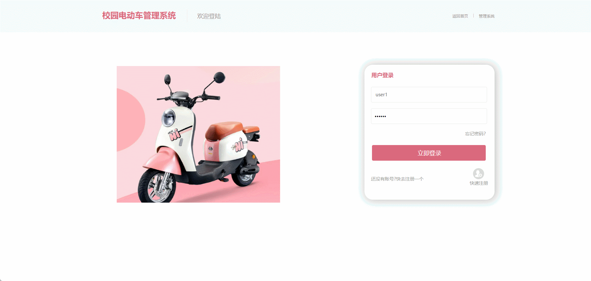
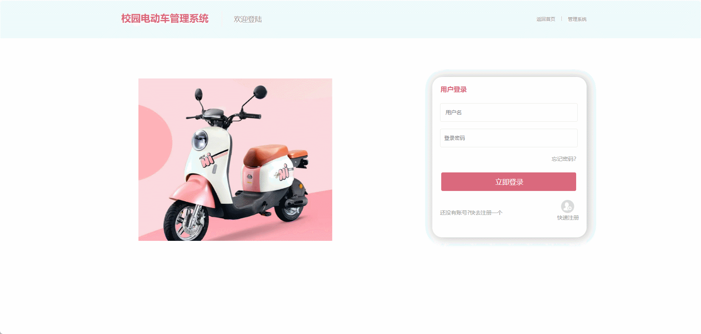
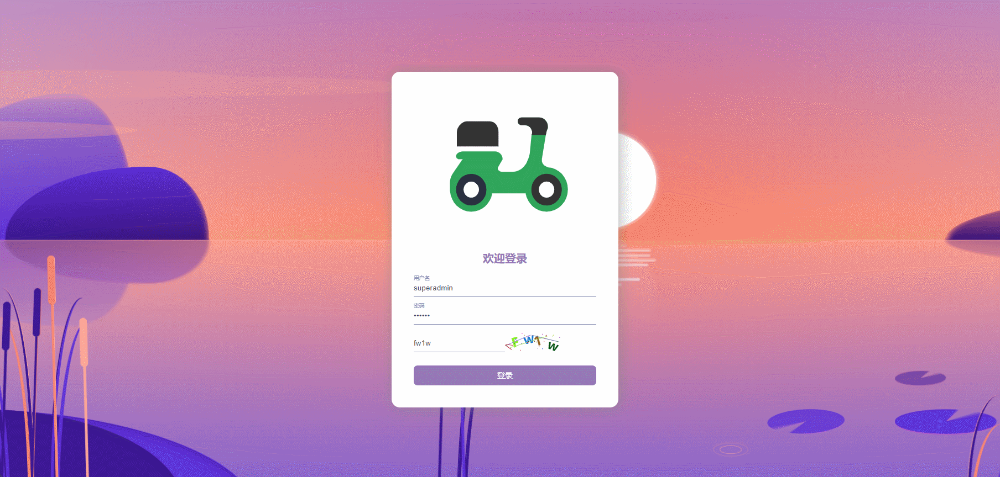

#  second-hand-store🎂

基于SpringBoot+Thymeleaf的校园电动车租赁平台

## 介绍🌞

> 本平台主要划分为系统管理员用户、普通管理员用户和普通用户三类人员。系统管理员包含整个系统的所有功能；普通用户主要功能围绕着对自身信息的管理进行，如对自己个人信息的完善和对自己拥有的车辆信息的完善，具体可进行的操作为：注册功能、登录功能、添加车辆信息、问题上报、举报违规行为、闲置车辆出租、查看出租信息、完善个人信息；普通管理员类用户为使用该系统的管理用户，主要负责电动车和普通用户的管理工作，具体可进行的操作为：注册功能、登录系统、管理车辆信息、发布公告等。


## 项目演示🌞

> 普通用户



> 普通管理员



> 系统管理员



## 安装教程🌞

```
1. 运行环境准备mysql5 + java8

2. 配置maven路径，加载依赖

3. 运行sql文件，确保application.yml或config.properties的数据库名称和账号密码是数据库所在主机的账号密码
```


## 使用说明🌞

```
1. 登入

    系统管理员账号：superadmin 密码：123456

    普通管理员：admin 密码：123456

    普通用户账号：user1 密码：123456
  
2. 运行流程

SpringBoot+Vue项目的部署详情可以查看这篇CSDN博客：http://t.csdnimg.cn/kpuxS

前后端不分离项目的部署流程可以查看这篇CSDN博客：http://t.csdnimg.cn/CslA5
```


## CSDN项目合集🌞

点击前往：http://t.csdnimg.cn/Q4u84


## 联系我🌞

**有偿获取完整源码或调试代码**

🐧：1902317191

wx：coding1902317191


